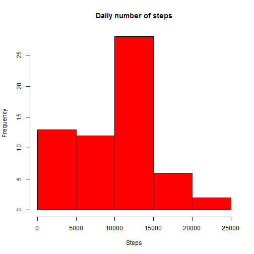
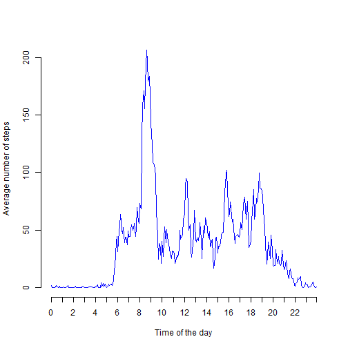
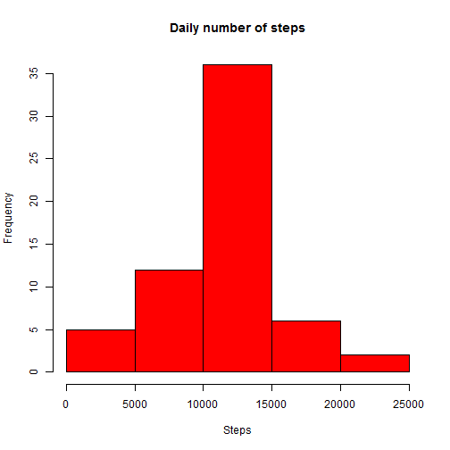
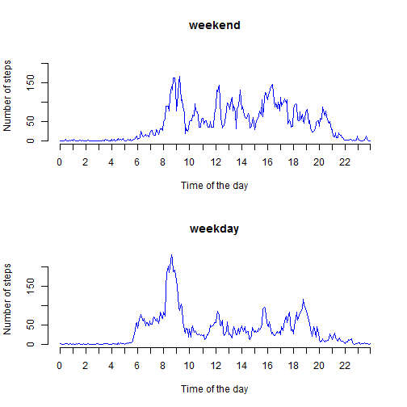

&nbsp;

## Loading and preprocessing the data

First of all, unzip and load the dataframe:


```r
unzip("activity.zip")
all_data <- read.csv("activity.csv")
```

Now create two new dataframes: "daily_data" containing the total data on a daily basis (adding over all intervals) and "interval_data" containing the average data on a 5-minute-interval basis (averaging over all days):


```r
# Create new data frame for daily data
daily_data <- data.frame(matrix(nrow=dim(all_data)[1]/(24*12),ncol=dim(all_data)[2]-1))

# Put the right content in it
names(daily_data) <- names(all_data)[1:dim(all_data)[2]-1]
daily_data$date <- as.Date(daily_data$date)
for(i in 1:length(daily_data$date)) {
  daily_data$date[i] <- all_data$date[i*24*12]
  day_steps <- all_data$steps[((i-1)*24*12+1):(i*24*12)]
  daily_data$steps[i] <- sum(day_steps[!is.na(day_steps)])
}
rm(day_steps,i)

# Create new data frame for interval data
interval_data <- data.frame(matrix(nrow=288,ncol=2))

# Put the right content in it
names(interval_data) <- names(all_data)[c(1,3)]
for(i in 1:288) {
  interval_data$interval[i] <- all_data$interval[i]
  interval_steps <- all_data$steps[0:60*288+i]
  interval_data$steps[i] <- mean(interval_steps[!is.na(interval_steps)])
}
rm(interval_steps,i)
```

&nbsp;

## What is mean total number of steps taken per day?

1. *Make a histogram of the total number of steps taken each day*


```r
hist(daily_data$steps, col="red", xlab="Steps", main="Daily number of steps")
```

 

2. *Calculate and report the **mean** and **median** total number of steps taken per day*


```r
mean(daily_data$steps)
```

```
## [1] 9354.23
```


```r
median(daily_data$steps)
```

```
## [1] 10395
```

&nbsp;

## What is the average daily activity pattern?

1. *Make a time series plot (i.e. `type = "l"`) of the 5-minute interval (x-axis) and the average number of steps taken, averaged across all days (y-axis)*


```r
plot(c(0:287),interval_data$steps,type="l",xlab="Time of the day",ylab="Average number of steps",axes=FALSE,col="blue")
axis(2)
axis(1,at=c(0:23*12,287),labels=c(0:23,2355))
```

 

2. *Which 5-minute interval, on average across all the days in the dataset, contains the maximum number of steps?*


```r
interval_data$interval[which(interval_data$steps==max(interval_data$steps))]
```

```
## [1] 835
```

&nbsp;

## Imputing missing values

1. *Calculate and report the total number of missing values in the dataset (i.e. the total number of rows with NAs)*


```r
sum(is.na(all_data$steps))
```

```
## [1] 2304
```

2. *Devise a strategy for filling in all of the missing values in the dataset. The strategy does not need to be sophisticated. For example, you could use the mean/median for that day, or the mean for that 5-minute interval, etc.*

I chose the mean for that 5-minute interval, rounded.

3. *Create a new dataset that is equal to the original dataset but with the missing data filled in.*


```r
# Fill them with interval data
all_data_complete <- all_data
missing_values <- which(is.na(all_data$steps))
for(i in 1:length(missing_values)) {
  index_i <- missing_values[i] %% 288
  if(index_i!=0) all_data_complete$steps[missing_values[i]] <- round(interval_data$steps[index_i])
  else all_data_complete$steps[missing_values[i]] <- round(interval_data$steps[288])
}
rm(missing_values,index_i,i,interval_data)

# Update daily_data accordingly
for(i in 1:length(daily_data$date)) {
  daily_data$steps[i] <- sum(all_data_complete$steps[((i-1)*24*12+1):(i*24*12)])
}
```

4. *Make a histogram of the total number of steps taken each day...*


```r
hist(daily_data$steps, col="red", xlab="Steps", main="Daily number of steps")
```

 

*...and Calculate and report the mean and median total number of steps taken per day. Do these values differ from the estimates from the first part of the assignment? What is the impact of imputing missing data on the estimates of the total daily number of steps?*


```r
mean(daily_data$steps)
```

```
## [1] 10765.64
```


```r
median(daily_data$steps)
```

```
## [1] 10762
```

Yes, the values differ from those calculated before imputing the missing data. Since all we are doing is adding up, obviously the new values add to the daily totals, increasing both the mean and the median. Furthermore, the distribution resembles a normal one much closer now, as can be seen from both the histogram and the fact that the mean and the median got a lot closer. This shows that the missing values were very concentrated, as if the device have been off on certain days, wrongly adding days with very little movement when not imputing the missing data.

&nbsp;

## Are there differences in activity patterns between weekdays and weekends?

1. *Create a new factor variable in the dataset with two levels -- "weekday" and "weekend" indicating whether a given date is a weekday or weekend day.*


```r
# Add day_type property:
all_data_complete$day_type <- factor("weekday",levels=c("weekday","weekend"))
for(i in 1:dim(all_data_complete)[1]) {
  this_day <- weekdays(as.Date(all_data_complete$date[i]))
  if(this_day=="Saturday"|this_day=="Sunday") all_data_complete$day_type[i] <- "weekend"
}
```

2. *Make a panel plot containing a time series plot (i.e. type = "l") of the 5-minute interval (x-axis) and the average number of steps taken, averaged across all weekday days or weekend days (y-axis).*

First of all, update interval_data:


```r
# Create new data frame for interval data
interval_data <- data.frame(matrix(nrow=288,ncol=3))

# Put the right content in it
names(interval_data) <- c("steps_weekday", "steps_weekend", "interval")
for(i in 1:288) {
  interval_data$interval[i] <- all_data_complete$interval[i]
  interval_steps <- all_data_complete$steps[0:60*288+i]
  interval_data$steps_weekday[i] <- mean(interval_steps[all_data_complete$day_type[1:61*288]=="weekday"])
  interval_data$steps_weekend[i] <- mean(interval_steps[all_data_complete$day_type[1:61*288]=="weekend"])
}
rm(this_day,interval_steps,i)
```

Now the plot:

```r
max_steps <- max(max(interval_data$steps_weekday),max(interval_data$steps_weekend))
par(mfrow=c(2,1))
plot(c(0:287),interval_data$steps_weekend,type="l",xlab="Time of the day",ylab="Number of steps",axes=FALSE,main="weekend",col="blue",ylim=c(0,max_steps))
axis(2)
axis(1,at=c(0:23*12,287),labels=c(0:23,2355))
plot(c(0:287),interval_data$steps_weekday,type="l",xlab="Time of the day",ylab="Number of steps",axes=FALSE,main="weekday",col="blue",ylim=c(0,max_steps))
axis(2)
axis(1,at=c(0:23*12,287),labels=c(0:23,2355))
```

 

As we can see, on weekdays the movement is much more concentrated around 8:40 am (probably the time of going to work) and is very low during worktime. At the weekend, it is much more distributed, with much more movement at noon and in the afternoon.

&nbsp;
